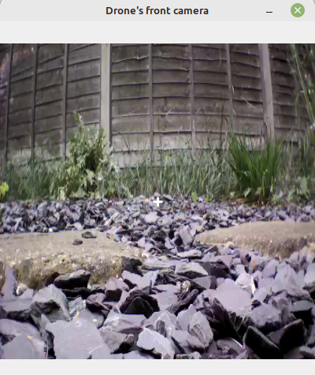
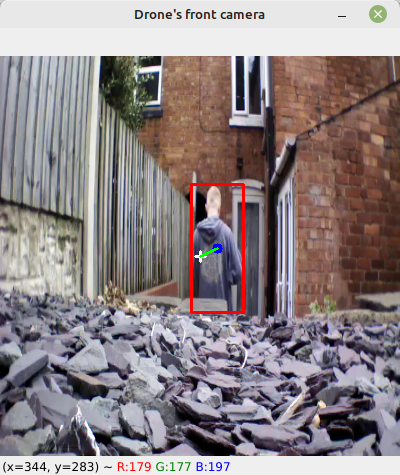

# Follow Me Drone
The Parrot AR Drone 2.0 is an affordable quadricopter featuring a front and ground camera, which through the excellent [PS-Drone API](http://www.playsheep.de/drone/index.html) is able to be controlled and programmed with Python. By using OpenCV and the drone's cameras alongside a custom-trained object detection model on the PyTorch implementation of the [YOLOv5](https://github.com/ultralytics/yolov5) algorithm, this package enables the drone to track and follow human or animal targets detected. User controls are also enabled as well as the option to start a self-landing feature where the drone lands on a specified marker. 

A CUDA-enabled GPU is recommended for object detection. CPUs can be used for object detection however this may significantly slow down it's performance.
## Requirements
- Parrot AR Drone 2.0
- POSIX-compliant operating system (such as Linux)
- Python 3.9 or higher
- [PS-Drone API](https://sourceforge.net/projects/ps-drone/files/)
- [YOLOv5](https://github.com/ultralytics/yolov5) for PyTorch
### Recommended
- CUDA-enabled GPU, [see list](https://developer.nvidia.com/cuda-gpus).
- CUDA v11.7
## Installation and running
1. Start a virtual environment and download the follow-me-drone package.
2. Ensure you have both ps_drone3.py from the [PS-Drone API](https://sourceforge.net/projects/ps-drone/files/), and [YOLOv5](https://github.com/ultralytics/yolov5) within your follow-me-drone directory.
3. In your console run: 
    ```
    pip install -r requirements.txt
    ``` 

    _For users wishing to use a CUDA-compatible GPU, also run the following to install PyTorch with CUDA-compatibility:_
    ```
    pip install torch==1.11.0+cu113 torchvision==0.12.0+cu113 torchaudio==0.11.0 --extra-index-url https://download.pytorch.org/whl/cu113
    ```
4. Connect to the AR Drone 2.0 through Wi-Fi.
5. Run the program with:
    ```
    python3 main.py
    ```
## Using the software
Upon startup there will be a short wait for the drone to connect. There will be an initial battery update and a window should appear containing a live stream of the drone's front camera. If there are no detections present within the camera's frame there should be a window containing the drone's front view with a crosshair in the center, for example:



Once there is a detection present within the drone's camera frame, the drone will automatically begin following the human or animal. A detection is shown in the camera frame with a red box surrounding it and a blue dot to mark its centerpoint, with a green line drawn between the crosshair and blue dot. 



The drone will track and follow a human or animal by first aligning the centerpoint of the camera frame with the centerpoint of the detection. The drone will then ensure that the detection takes up 24-26% of the camera frame by moving towards or away from the human or animal. The drone will continue to follow detections until the program is quit or the self-landing function is activated.
### Self-landing
The self-landing feature can be activated by an 'L' keypress within the console. This switches the window's view to the drone's ground camera and the drone will begin searching for the landing marker which should come within your AR Drone 2.0's box. If you do not have one this is within the package as `landing_marker.png`. It is recommended you print this out to at least size A4.


The camera window will show the drone's ground camera analysing the frame for the landing marker. Once it is found, the drone will center it's ground camera frame over the marker and then land.

Alternatively, if you do not wish to use the self-landing feature and want to land the drone over its current position, simply press 'Q' within the console to quit the program. A full list of controls is available below.

### Controls
| Key | Function          |
|-----|-------------------|
| T   | Takeoff           |
| L   | Self-land         |
| Q   | Exit program & land drone |
| B   | Battery update    |
